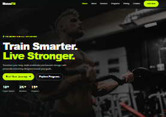
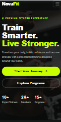

# NovaFit — Fitness Business Website

A modern, responsive fitness business website designed to showcase training services, programs, pricing, results, testimonials, and contact information.

## 🚀 Live Demo

[View Live Demo](https://alefantverse.github.io/novafit/)

## 📸 Screenshots

### Desktop

### Mobile

## 🛠️ Technologies

- HTML5
- CSS3
- JavaScript
- Bootstrap 5
- Font Awesome

## ✨ Features

- Fully responsive design
- Modern fitness-focused user interface
- Responsive navigation
- Hero section with clear calls to action
- Services and training programs
- Pricing section
- Results and testimonials
- Contact form
- Responsive footer
- Scroll-to-top functionality
- Mobile-friendly layouts

## 📱 Responsive Design

NovaFit was designed and tested across different screen sizes to provide a consistent and user-friendly experience on desktop, tablet, and mobile devices.

## 🎯 Project Purpose

NovaFit was created as a portfolio project to demonstrate my ability to design and develop responsive business websites using HTML, CSS, JavaScript, and Bootstrap.

## 👨‍💻 Developer

**Alefantverse**

Web Developer | Responsive Websites & Digital Solutions